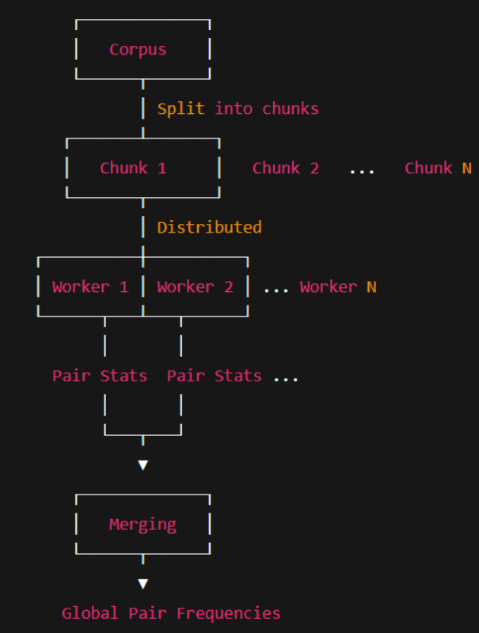

# `tiny-BPE`

### `BPE or byte pair encoding from a high level involves the following steps`


`parallelization of file chunking`




Before your favorite transformer model can understand language, it first has to tokenize it. 

BPE or Byte Pair Encoding, is the tokenization algorithm behind GPT2 in pre-training. 
Here we will be implementing a parallel and minimal implementation of it from scratch in less than 200 lines of python code.
<br></br>
## a gentle intro to BPE
before we dive into any code we'll understand the algorithm and a bit of its advantages / disadvantages with a small example.


### 1. **pre-tokenization**

**input** : raw text corpus (or chunked text if you have very big text files / data)

**process** : break down the raw text into an initial sequence of **"base units"** before BPE merging begins. these base units are typically chosen to be linguistically sensible (like words, punctuation, or individual characters/bytes).

this is where decisions about pre-tokenization schemes occur : byte-level, character-level, or whitespace-based splitting etc. 

the choice of pre-tokenization is crucial because **it defines the initial set of symbols that BPE will start merging from.**

- **whitespace pre-tokenization** : splits text into words and punctuation based on spaces. each "word" and "punctuation mark" then becomes a base unit.

- **byte-level pre-tokenization (the most "raw" form)** : splits everything into individual bytes. so, if your input is "hello," the base units are [h, e, l, l, o]. If it's 书, the base units are [E4, B9, A6]. in this case, there's no "semantic" pre-tokenization; it's just the raw bytes.

- modern LMs use custom built complex regex based splitting for pre-tokenization.
for this blog **we'll be using the gpt-2 regex pre-tokenizer** : 

&nbsp;&nbsp;&nbsp;&nbsp;&nbsp;&nbsp;&nbsp;**```
PAT = r"""'(?:[sdmt]|ll|ve|re)| ?\p{L}+| ?\p{N}+| ?[^\s\p{L}\p{N}]+|\s+(?!\S)|\s+"""```**

**output** : a training corpus represented as a sequence of these base units obtained after pre-tokenization.

<br></br>
### 2. **initial vocabulary creation** 

**input** : the sequences obtained after pre-tokenization of the corpus.

**process** : collect all unique base units from the input.

**output** : an initial vocabulary (set of unique tokens) and typically an initial mapping of these tokens to integer IDs.

<br></br>
### 3. **calculate initial pair frequencies**

**input** : the corpus (as sequence of initial tokens after pre-tokenization)

**process** : iterate through the corpus and count the occurrences of every adjacent pair of tokens.

**output** : a collection of all unique adjacent pairs and their frequencies.

<br></br>

### 4. **iterative merging (the core BPE loop)**

this is where most of the meat is.

**input** : the current corpus, current vocabulary, and current pair frequencies.

**process (repeated until desired `vocab_size` or number of merges is reached)** : 

1. **find most frequent pair** : identify the pair (A, B) with the highest frequency. 

2. **create new token** : form a new token AB (representing the sequence A followed by B). 

3. **add to vocabulary & assign ID** : add AB to the vocabulary and assign it a new, unique integer ID. 

4. **update corpus** : replace all occurrences of the pair (A, B) in the corpus with the new token AB. 

5. **update pair frequencies** : recalculate (or incrementally update) the frequencies of all adjacent pairs in the modified corpus. this is crucial because replacing (A, B) might create new adjacent pairs (e.g., (X, AB) and (AB, Y)) and remove others.

<br></br>
### 5. final vocabulary and encoding map :

**input** : the final vocabulary and all learned merges.

**process** : store the final set of tokens and their assigned integer IDs. the sequence of merges learned implicitly defines how any new text will be tokenized.

**output** : a tokenizer model that can apply the learned merges to new input text, converting it into a sequence of token IDs.
<br></br>

## implementing the algorithm


### **chunking a file to obtain initial pair frequencies**

<br></br>

but let's import the dependencies and establish our special token(s) first:

```python3
import os
import re
from collections import defaultdict
from typing import BinaryIO
from multiprocessing import Pool

# GPT-2 regex pre-tokenizer
PAT = r"""'(?:[sdmt]|ll|ve|re)| ?\p{L}+| ?\p{N}+| ?[^\s\p{L}\p{N}]+|\s+(?!\S)|\s+"""
TOKENIZER = re.compile(PAT, re.IGNORECASE)
SPECIAL_TOKEN = "<|endofdoc|>"  # marker for splitting documents
```
<br></br>
**chunking function** : splits input into manageable sublists of tokens.

when dealing with huge corpora, running BPE on the entire dataset at once is inefficient. instead, we divide the text into smaller chunks.
each chunk is just a slice of the corpus (like splitting a big book into chapters).

this makes processing more manageable and avoids memory bottlenecks.

**parallel counting function** : each worker counts pair frequencies inside its chunk.

once we have chunks, we can distribute them across multiple CPU cores using Python’s `multiprocessing.Pool`.
each worker process independently applies regex-based pre-tokenization and computes pair statistics.
workers don’t interfere with each other — they just work on their assigned chunk.

after finishing, they return intermediate results.

**reduction step** : merge all results into a global counter.
after parallel execution, we need to merge the results back into a single global state.
pair frequencies from all chunks are aggregated.

the most frequent pairs are then selected globally for the next merge iteration.

this mimics MapReduce-style processing:
**Map phase** → each worker counts pairs in a chunk.
**Reduce phase** → results are aggregated.
<br></br>
```python

def find_chunk_boundaries(
    file: BinaryIO,
    desired_num_chunks: int,
    split_special_token: bytes
) -> list[int]:
    """
    Find safe chunk boundaries in a file for parallel pre-tokenization.
    Ensures we don't split in the middle of a document.
    """
    assert isinstance(split_special_token, bytes), "split_special_token must be bytes"

    file.seek(0, os.SEEK_END)
    file_size = file.tell()
    file.seek(0)

    chunk_size = file_size // desired_num_chunks
    chunk_boundaries = [i * chunk_size for i in range(desired_num_chunks + 1)]
    chunk_boundaries[-1] = file_size

    mini_chunk_size = 4096  # read-ahead buffer

    for bi in range(1, len(chunk_boundaries) - 1):
        pos = chunk_boundaries[bi]
        file.seek(pos)
        while True:
            mini_chunk = file.read(mini_chunk_size)
            if not mini_chunk:  # reached EOF
                chunk_boundaries[bi] = file_size
                break
            found_at = mini_chunk.find(split_special_token)
            if found_at != -1:
                chunk_boundaries[bi] = pos + found_at
                break
            pos += mini_chunk_size

    return sorted(set(chunk_boundaries))


def process_chunk(args):
    """Worker function: tokenize a file chunk and count token frequencies."""
    filename, start, end = args
    counts = defaultdict(int)

    with open(filename, "rb") as f:
        f.seek(start)
        chunk = f.read(end - start).decode("utf-8", errors="ignore")

    docs = re.split(re.escape(SPECIAL_TOKEN), chunk)
    for doc in docs:
        for match in TOKENIZER.finditer(doc):
            token = match.group()
            counts[token] += 1

    return counts


def merge_counts(dicts):
    """Reducer: merge token frequency dictionaries from different workers."""
    merged = defaultdict(int)
    for d in dicts:
        for k, v in d.items():
            merged[k] += v
    return merged


def run_pre_tokenization_parallel(filename: str, num_processes: int = 4):
    """Run pre-tokenization in parallel across file chunks."""
    with open(filename, "rb") as f:
        boundaries = find_chunk_boundaries(f, num_processes, SPECIAL_TOKEN.encode("utf-8"))

    args = [(filename, s, e) for s, e in zip(boundaries[:-1], boundaries[1:])]

    with Pool(num_processes) as pool:
        partial_counts = pool.map(process_chunk, args)

    return merge_counts(partial_counts)

```
<br></br>
### writing a function to obtain pair frequencies 

once we’ve got our initial vocabulary and tokenized corpus, **the next step is to look for the most promising merge candidates.**

- this function scans through every token sequence in the training corpus and counts how often each adjacent pair occurs.
- think of it like tallying up which bigrams (“he”, “el”, “ll”, etc.) appear most often.

- the output is a dictionary mapping (A, B) → frequency.
- the pair with the highest frequency will be the one we merge next.

this step is crucial because BPE’s core idea is to merge the most frequent symbol pairs to build subword units.

```python3
def get_pair_counts(self, freqs: dict[tuple[tuple[int, ...]], int]) -> dict[tuple[int, int], int]:
        """Count frequency of all adjacent byte pairs."""
        pair_counts = defaultdict(int)
        for sequence, count in freqs.items():
            for i in range(len(sequence) - 1):
                pair_counts[(sequence[i], sequence[i + 1])] += count
        return pair_counts
```
<br></br>
### the bpe merging (or training) loop

this is the **heart** of the BPE algorithm as this loop is where BPE learns its vocabulary.

**we start with raw bytes as our base units.**

on each iteration:

- find the most frequent pair (using **`get_pair_counts`**).
- merge it into a new token.
- update the vocabulary with this new entry.
- replace all occurrences of that pair in the training corpus.

over many iterations, the tokenizer builds a compact vocabulary: common patterns like `th`, `ing`, or even full words get merged into single tokens. rare words remain split into smaller subwords.

this iterative process is why **BPE balances efficiency (smaller vocabularies) with flexibility (still handles unseen words or [out-of-vocabulary words](https://spotintelligence.com/2024/10/08/out-of-vocabulary-oov-words/#What_are_Out-of-Vocabulary_OOV_Words)).**

```python3
   def train(self, filename: str, vocab_size: int, num_processes: int = 4):
        """Train BPE merges and vocab from corpus."""
        pre_token_counts = self.run_pre_tokenization_parallel(filename, num_processes)

        # Initialize vocab with byte sequences
        freqs: dict[tuple[tuple[int, ...]], int] = {}
        for token, count in pre_token_counts.items():
            token_bytes = token.encode("utf-8")
            token_seq = tuple((b,) for b in token_bytes)
            freqs[token_seq] = count
            for b in token_seq:
                if b not in self.vocab:
                    self.vocab[b] = self.next_id
                    self.next_id += 1

        # Iteratively learn merges
        while len(self.vocab) < vocab_size:
            pair_counts = self.get_pair_counts(freqs)
            if not pair_counts:
                break

            max_pair = max(pair_counts.items(), key=lambda x: (x[1], x[0]))[0]
            merged_token = max_pair[0] + max_pair[1]

            if merged_token in self.vocab:
                continue

            self.vocab[merged_token] = self.next_id
            self.next_id += 1
            self.merges.append(max_pair)

            # Replace max pair in sequences
            new_freqs = {}
            for seq, freq in freqs.items():
                new_seq = []
                i = 0
                while i < len(seq):
                    if i < len(seq) - 1 and (seq[i], seq[i + 1]) == max_pair:
                        new_seq.append(merged_token)
                        i += 2
                    else:
                        new_seq.append(seq[i])
                        i += 1
                new_freqs[tuple(new_seq)] = freq
            freqs = new_freqs

        # Build inverse vocab for decoding
        self.inv_vocab = {idx: tok for tok, idx in self.vocab.items()}
```
<br></br>
### the encode method

once training is done, we can tokenize new text.

- the encode function **starts with raw bytes of a word and repeatedly applies the learned merge rules, collapsing frequent pairs into bigger chunks until no more merges apply.**

- for example, given the merges **`[("t","h"), ("th","e")]`**, the string "the" would first go from **`["t","h","e"] → ["th","e"] → ["the"]`**.

- the result is a **list of integer IDs representing tokens, exactly what a transformer model consumes.**

```python3
def encode(self, text: str) -> list[int]:
        """Encode text into BPE token IDs."""
        pre_tokens = re.findall(self.PAT, text)
        token_ids = []
        merge_set = set(self.merges)

        for token in pre_tokens:
            byte_seq = [(b,) for b in token.encode("utf-8")]

            while True:
                merged = False
                i = 0
                new_seq = []
                while i < len(byte_seq):
                    if i < len(byte_seq) - 1 and (byte_seq[i], byte_seq[i+1]) in merge_set:
                        new_seq.append(byte_seq[i] + byte_seq[i+1])
                        i += 2
                        merged = True
                    else:
                        new_seq.append(byte_seq[i])
                        i += 1
                byte_seq = new_seq
                if not merged:
                    break

            token_ids.extend(self.vocab[tok] for tok in byte_seq)

        return token_ids
```
<br></br>

### the decode method

- encoding wouldn’t be useful without decoding.

- the decode method simply does the reverse lookup: it maps token IDs back to their byte sequences, then stitches them into a UTF-8 string.

- because **BPE is reversible**, we can always reconstruct the exact original text, crucial for language models to make sense of inputs and outputs.

- and simply put **without a proper decode step, the tokenizer wouldn’t be useful in real-world NLP tasks.**


```python3
def decode(self, token_ids: list[int]) -> str:
        """Decode token IDs back into string."""
        byte_seq = []
        for tid in token_ids:
            tok_bytes = self.inv_vocab[tid]
            byte_seq.extend(tok_bytes if isinstance(tok_bytes, tuple) else [tok_bytes])

        # Convert list of ints back into bytes → decode utf-8
        return bytes(byte_seq).decode("utf-8", errors="ignore")
```
<br></br>

## combining everything into a single class

here’s the full implementation tied together in a single **`BPETokenizer`** class, so you can train, encode, and decode with just a few calls.

```python3

import os
import re
from collections import defaultdict
from typing import BinaryIO
from multiprocessing import Pool


class BPETokenizer:
    # GPT-2 regex pre-tokenizer
    PAT = r"""'(?:[sdmt]|ll|ve|re)| ?\p{L}+| ?\p{N}+| ?[^\s\p{L}\p{N}]+|\s+(?!\S)|\s+"""
    TOKENIZER = re.compile(PAT, re.IGNORECASE)
    SPECIAL_TOKEN = "<|endofdoc|>"

    def __init__(self):
        self.vocab: dict[tuple[int, ...], int] = {}
        self.inv_vocab: dict[int, tuple[int, ...]] = {}
        self.merges: list[tuple] = []
        self.next_id: int = 0

    # ---------- Chunking for parallel pre-tokenization ----------
    def find_chunk_boundaries(
        self, file: BinaryIO, desired_num_chunks: int, split_special_token: bytes
    ) -> list[int]:
        """Find safe chunk boundaries in a file for parallel pre-tokenization."""
        assert isinstance(split_special_token, bytes), "split_special_token must be bytes"

        file.seek(0, os.SEEK_END)
        file_size = file.tell()
        file.seek(0)

        chunk_size = file_size // desired_num_chunks
        chunk_boundaries = [i * chunk_size for i in range(desired_num_chunks + 1)]
        chunk_boundaries[-1] = file_size

        mini_chunk_size = 4096

        for bi in range(1, len(chunk_boundaries) - 1):
            pos = chunk_boundaries[bi]
            file.seek(pos)
            while True:
                mini_chunk = file.read(mini_chunk_size)
                if not mini_chunk:  # EOF
                    chunk_boundaries[bi] = file_size
                    break
                found_at = mini_chunk.find(split_special_token)
                if found_at != -1:
                    chunk_boundaries[bi] = pos + found_at
                    break
                pos += mini_chunk_size

        return sorted(set(chunk_boundaries))

    def _process_chunk(self, args):
        """Worker: tokenize file chunk and count token frequencies."""
        filename, start, end = args
        counts = defaultdict(int)

        with open(filename, "rb") as f:
            f.seek(start)
            chunk = f.read(end - start).decode("utf-8", errors="ignore")

        docs = re.split(re.escape(self.SPECIAL_TOKEN), chunk)
        for doc in docs:
            for match in self.TOKENIZER.finditer(doc):
                token = match.group()
                counts[token] += 1
        return counts

    def _merge_counts(self, dicts):
        merged = defaultdict(int)
        for d in dicts:
            for k, v in d.items():
                merged[k] += v
        return merged

    def run_pre_tokenization_parallel(self, filename: str, num_processes: int = 4):
        """Parallel pre-tokenization across file chunks."""
        with open(filename, "rb") as f:
            boundaries = self.find_chunk_boundaries(
                f, num_processes, self.SPECIAL_TOKEN.encode("utf-8")
            )

        args = [(filename, s, e) for s, e in zip(boundaries[:-1], boundaries[1:])]

        with Pool(num_processes) as pool:
            partial_counts = pool.map(self._process_chunk, args)

        return self._merge_counts(partial_counts)

    # ---------- Training ----------
    def get_pair_counts(self, freqs: dict[tuple[tuple[int, ...]], int]) -> dict[tuple[int, int], int]:
        """Count frequency of all adjacent byte pairs."""
        pair_counts = defaultdict(int)
        for sequence, count in freqs.items():
            for i in range(len(sequence) - 1):
                pair_counts[(sequence[i], sequence[i + 1])] += count
        return pair_counts

    def train(self, filename: str, vocab_size: int, num_processes: int = 4):
        """Train BPE merges and vocab from corpus."""
        pre_token_counts = self.run_pre_tokenization_parallel(filename, num_processes)

        # Initialize vocab with byte sequences
        freqs: dict[tuple[tuple[int, ...]], int] = {}
        for token, count in pre_token_counts.items():
            token_bytes = token.encode("utf-8")
            token_seq = tuple((b,) for b in token_bytes)
            freqs[token_seq] = count
            for b in token_seq:
                if b not in self.vocab:
                    self.vocab[b] = self.next_id
                    self.next_id += 1

        # Iteratively learn merges
        while len(self.vocab) < vocab_size:
            pair_counts = self.get_pair_counts(freqs)
            if not pair_counts:
                break

            max_pair = max(pair_counts.items(), key=lambda x: (x[1], x[0]))[0]
            merged_token = max_pair[0] + max_pair[1]

            if merged_token in self.vocab:
                continue

            self.vocab[merged_token] = self.next_id
            self.next_id += 1
            self.merges.append(max_pair)

            # Replace max pair in sequences
            new_freqs = {}
            for seq, freq in freqs.items():
                new_seq = []
                i = 0
                while i < len(seq):
                    if i < len(seq) - 1 and (seq[i], seq[i + 1]) == max_pair:
                        new_seq.append(merged_token)
                        i += 2
                    else:
                        new_seq.append(seq[i])
                        i += 1
                new_freqs[tuple(new_seq)] = freq
            freqs = new_freqs

        # Build inverse vocab for decoding
        self.inv_vocab = {idx: tok for tok, idx in self.vocab.items()}

    # ---------- Encoding / Decoding ----------
    def encode(self, text: str) -> list[int]:
        """Encode text into BPE token IDs."""
        pre_tokens = re.findall(self.PAT, text)
        token_ids = []
        merge_set = set(self.merges)

        for token in pre_tokens:
            byte_seq = [(b,) for b in token.encode("utf-8")]

            while True:
                merged = False
                i = 0
                new_seq = []
                while i < len(byte_seq):
                    if i < len(byte_seq) - 1 and (byte_seq[i], byte_seq[i+1]) in merge_set:
                        new_seq.append(byte_seq[i] + byte_seq[i+1])
                        i += 2
                        merged = True
                    else:
                        new_seq.append(byte_seq[i])
                        i += 1
                byte_seq = new_seq
                if not merged:
                    break

            token_ids.extend(self.vocab[tok] for tok in byte_seq)

        return token_ids

    def decode(self, token_ids: list[int]) -> str:
        """Decode token IDs back into string."""
        byte_seq = []
        for tid in token_ids:
            tok_bytes = self.inv_vocab[tid]
            byte_seq.extend(tok_bytes if isinstance(tok_bytes, tuple) else [tok_bytes])

        # Convert list of ints back into bytes → decode utf-8
        return bytes(byte_seq).decode("utf-8", errors="ignore")

```

<br></br>

byte pair encoding (BPE) is deceptively simple, yet incredibly powerful in how it builds compact token vocabularies. in our implementation, we walked through pair frequency calculation, iterative merging, and encoding/decoding, seeing firsthand how repeated subword merges emerge into meaningful tokens.

that said, **there’s always room for optimization, especially in the merge step.** right now, **pair frequencies are recomputed from scratch each iteration, which isn’t the most efficient.**

# NOTE(s): 

### `using techniques like reverse indexing or a priority queue to track the most frequent pairs can significantly speed things up for larger corpora.`


